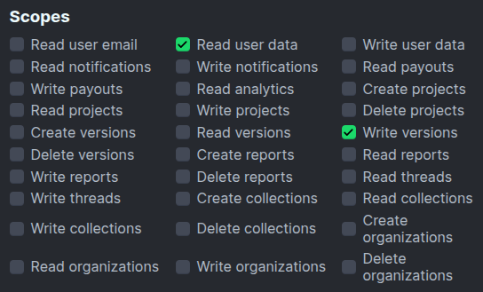

# Modrinth Bulk Version Adder 🪄📦

Easily add a **Minecraft version** to multiple Modrinth projects at once.

When Mojang pushes a new game version, running this script means you no longer need to open each project page and click through the UI by hand.  
Instead, run the Python script, enter your **Modrinth Personal Access Token (PAT)**, tick the projects, write the versions you want, and let it handle the API calls for you.

> 💡 **Prefer a web version?** Use it here: [https://3gee.is-a.dev/modrinth-bulk-version-adder/](https://3gee.is-a.dev/modrinth-bulk-version-adder/)


---

## ✨ Features

- Interactive **command‑line wizard** powered by `questionary`
- Bulk adds versions *with a single PAT* – nothing to copy‑paste again
- Gracefully skips projects that already have the selected version
- Clear progress output so you can see what happened
- Ability to add HARDCODED TOKEN to code

---

## 🔑 Modrinth PAT – Required Scopes

When generating a token at <https://modrinth.com/settings/pats>, enable **exactly** these two scopes:

| Scope | Why it’s needed |
|-------|-----------------|
| `read user data` | List your projects & verify ownership |
| `write versions` | Create new version entries |



Do **not** give the token broader permissions than necessary.

---

## 📦 Installation

```bash
# Clone the repo
git clone https://github.com/<your‑name>/bulk-version-adder.git
cd bulk-version-adder

# Install dependencies
pip install -r requirements.txt

# Run The Script
python bulk-version-adder.py
```

**Alternatively, use the web version instead of installing anything:** [https://3gee.is-a.dev/modrinth-bulk-version-adder/](https://3gee.is-a.dev/modrinth-bulk-version-adder/)

---

## ⚠️ Danger / Disclaimer

I am NOT responsible for any data loss, mod removal, or other damage that may occur while using this tool.
You use Bulk Version Adder at your own risk. Always keep backups of your projects and verify that your PAT has the minimum required scopes before running the script.
